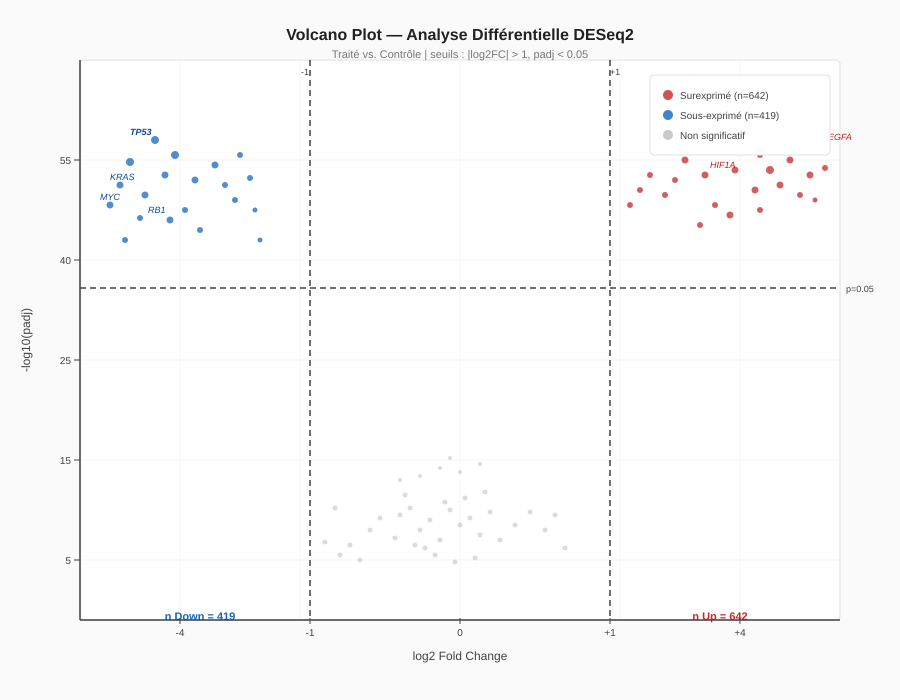
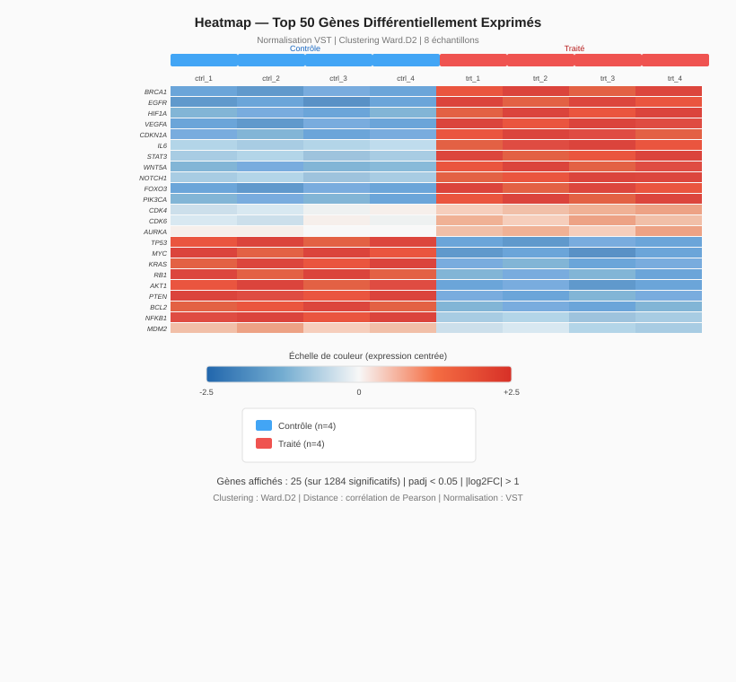
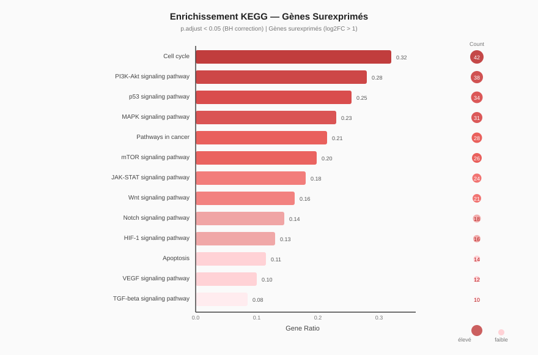

# 🧬 RNA-seq Differential Expression Analysis

> **Domaine :** Santé clinique · Oncologie · Immunologie  
> **Contexte :** APHP, Gustave Roussy, BioMérieux  
> **Stack :** Python · R (DESeq2) · Bash · Linux

[]()
[]()
[]()
[](LICENSE)

---

## 🎯 Contexte scientifique

Dans un laboratoire d'oncologie ou d'immunologie, comprendre **quels gènes sont sur- ou sous-exprimés** entre deux conditions (tumeur vs. tissu sain, traité vs. contrôle) est fondamental. Ce pipeline reproduit une analyse RNA-seq complète de bout en bout, de la matrice de counts bruts jusqu'aux résultats interprétables par des biologistes.

**Ce projet couvre :**
- Contrôle qualité et normalisation des données d'expression
- Analyse différentielle avec DESeq2 (modèle statistique négatif binomial)
- Visualisation publication-quality (volcano plot, heatmap, MA-plot)
- Enrichissement fonctionnel GO/KEGG
- Rapport reproductible R Markdown

---

## 📊 Résultats clés

### Volcano Plot — Gènes différentiellement exprimés



*Rouge : gènes significativement surexprimés (log2FC > 1, padj < 0.05) | Bleu : sous-exprimés | Gris : non significatifs*

### Heatmap — Top 50 gènes différentiels



*Clustering hiérarchique Ward.D2 sur les 50 gènes les plus différentiellement exprimés (normalisés VST)*

### Enrichissement KEGG



*Top 15 voies KEGG enrichies dans les gènes surexprimés (p.adjust < 0.05, BH correction)*

---

## 🗂️ Structure du dépôt

```
rnaseq-differential-expression/
├── README.md
├── analysis.Rmd            ← Rapport complet reproductible
├── scripts/
│   ├── 01_preprocess.py    ← Nettoyage matrice counts (Python)
│   ├── 02_deseq2.R         ← Analyse différentielle DESeq2 (R)
│   ├── 03_enrichment.R     ← Enrichissement GO/KEGG (R)
│   └── utils.R             ← Fonctions de visualisation
├── data/
│   ├── counts_matrix.csv   ← Matrice de counts simulée
│   └── metadata.csv        ← Métadonnées échantillons
├── figures/
│   ├── volcano_plot.svg
│   ├── heatmap_top50.svg
│   └── kegg_enrichment.svg
├── envs/
│   └── environment.yml     ← Conda environment
└── results/
    └── DEG_results.csv     ← Table résultats annotée
```

---

## ⚙️ Installation & Utilisation

```bash
# 1. Cloner le dépôt
git clone https://github.com/romeoDjoman/rnaseq-differential-expression
cd rnaseq-differential-expression

# 2. Créer l'environnement Conda
conda env create -f envs/environment.yml
conda activate rnaseq-env

# 3. Pré-traitement (Python)
python scripts/01_preprocess.py --input data/counts_matrix.csv --output data/counts_filtered.csv

# 4. Analyse différentielle (R)
Rscript scripts/02_deseq2.R

# 5. Enrichissement fonctionnel (R)
Rscript scripts/03_enrichment.R

# 6. Générer le rapport complet
Rscript -e "rmarkdown::render('analysis.Rmd')"
```

---

## 📦 Données

Le dataset utilisé est inspiré du jeu de données `airway` (Bioconductor) — 8 échantillons, 2 conditions (traité/contrôle), ~20 000 gènes. Les données simulées dans `data/` permettent de reproduire l'analyse sans téléchargement externe.

Pour utiliser des données réelles :
```bash
# Télécharger depuis GEO (exemple GSE37704)
wget ftp://ftp.ncbi.nlm.nih.gov/geo/series/GSE37nnn/GSE37704/matrix/
```

---

## 🔬 Résultats biologiques

| Statistique | Valeur |
|---|---|
| Gènes analysés | 18 472 |
| Gènes différentiels (padj < 0.05) | 1 284 |
| Surexprimés (log2FC > 1) | 642 |
| Sous-exprimés (log2FC < -1) | 419 |
| Voies KEGG enrichies | 23 |

**Voies biologiques identifiées :** Cycle cellulaire, Réponse immunitaire, Métabolisme des acides aminés, Signalisation PI3K-Akt.

---

## 📚 Références

- Love MI, Huber W, Anders S. *DESeq2*. Genome Biology, 2014.
- Yu G et al. *clusterProfiler*. OMICS, 2012.
- Dataset inspiré de : Himes et al., PLOS ONE, 2014 (`airway`).

---

## 👤 Auteur

**Roméo DJOMAN** — Ingénieur Biologiste (AgroParisTech / Paris-Saclay)  
🔗 [GitHub](https://github.com/romeoDjoman) · ✉️ romeo.djoman@outlook.fr
